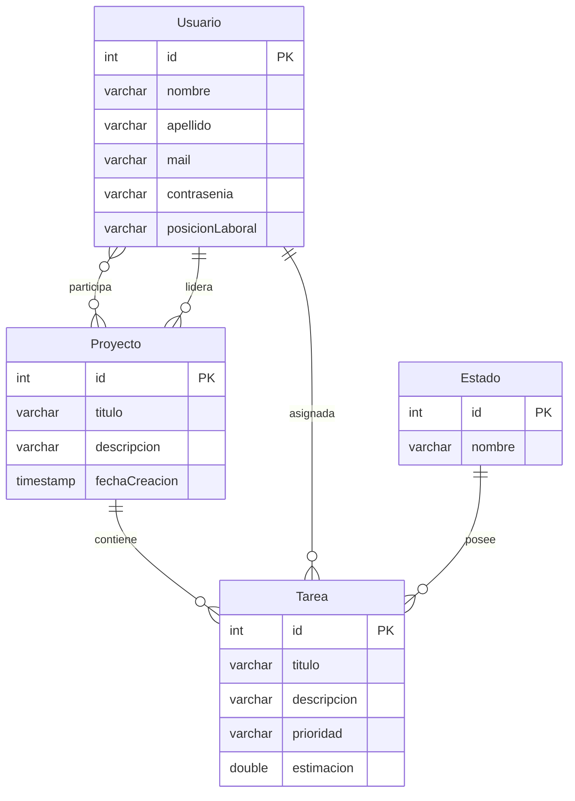

```mermaid
erDiagram

    Usuario {
        int id PK
        varchar nombre
        varchar apellido
        varchar mail
        varchar contrasenia
        varchar posicionLaboral
    }

    Proyecto {
        int id PK
        varchar titulo
        varchar descripcion
        timestamp fechaCreacion
    }

    Tarea {
        int id PK
        varchar titulo
        varchar descripcion
        varchar prioridad
        double estimacion
    }

    Estado {
        int id PK
        varchar nombre
    }

    Proyecto ||--o{ Tarea : contiene
    Usuario ||--o{ Tarea : asignada
    Estado ||--o{ Tarea : posee

    Usuario }o--o{ Proyecto : participa
    Usuario ||--o{ Proyecto : lidera
```